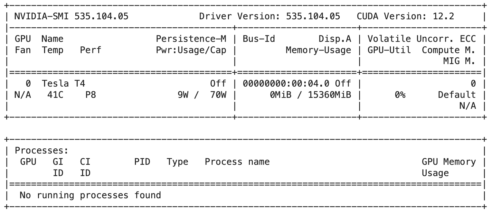
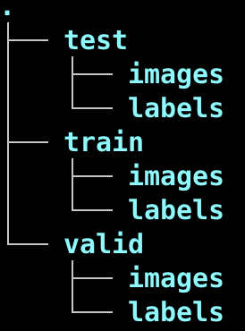
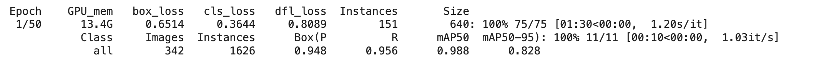
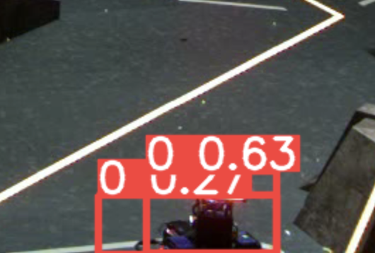

# 下学期第一次任务

##### 复现需要将device改为cuda，本机使用mps

## 一.  MINIST手写数据集识别

### 使用最弱的全连接网络进行训练

使用pytorch自带的minist数据集API进行对于数据集的下载

~~开袋即食~~

```python
train_dataset = torchvision.datasets.MNIST(root='./data', train=True, download=True, transform=transform)
test_dataset = torchvision.datasets.MNIST(root='./data', train=False, download=True, transform=transform)

# 创建数据加载器
train_loader = DataLoader(dataset=train_dataset, batch_size=batch_size, shuffle=True)
test_loader = DataLoader(dataset=test_dataset, batch_size=batch_size, shuffle=False)
```

对于全局变量的定义

```python
# 2. 定义超参数
input_size = 784  # MNIST图片大小是28x28
hidden_sizes = [128, 64]  # 隐藏层的大小
output_size = 10  # 输出的类别数为10，分别对应0到9的数字
num_epochs = 50  # 进行5次训练迭代
batch_size = 64  # 每批次处理64张图片
learning_rate = 0.001  # 学习率设置为0.001

# 3. 数据准备
transform = transforms.Compose([
    transforms.ToTensor(),  # 将图片转换成PyTorch的Tensor格式
    transforms.Normalize((0.5,), (0.5,))  # 标准化处理，以减小模型对数据规模的敏感性
])
```
对于神经网络定义的部分，直接暴力全连接三层

```python
 def __init__(self, input_size, hidden_sizes, output_size):
        super(NeuralNet, self).__init__()
        self.fc1 = nn.Linear(input_size, hidden_sizes[0])
        self.fc2 = nn.Linear(hidden_sizes[0], hidden_sizes[1])
        self.fc3 = nn.Linear(hidden_sizes[1], output_size)
        self.relu = nn.ReLU()
```
传播函数使用ReLU激活函数进行激活

```python
def forward(self, x):
    x = self.relu(self.fc1(x))
    x = self.relu(self.fc2(x))
    x = self.fc3(x)
    return x
```

训练的效果似乎是不差的，但是问题出在了OJ上评测的时候似乎model_load_error

模型保存的问题？但是接下来使用的cnn网络没有问题

### 使用CNN神经网络进行图像的分析

```python
def __init__(self):
        super(Net, self).__init__()
        # 卷积层
        self.conv1 = nn.Conv2d(1, 32, kernel_size=3, padding=1)
        self.batchnorm1 = nn.BatchNorm2d(32)
        self.conv2 = nn.Conv2d(32, 64, kernel_size=3, padding=1)
        self.batchnorm2 = nn.BatchNorm2d(64)
        self.conv3 = nn.Conv2d(64, 128, kernel_size=3, padding=1)
        self.batchnorm3 = nn.BatchNorm2d(128)
        # Dropout层
        self.dropout1 = nn.Dropout2d(0.25)
        self.dropout2 = nn.Dropout2d(0.5)
        # 全连接层
        self.fc1 = nn.Linear(128 * 7 * 7, 256) # 更正全连接层输入特征数
        self.fc2 = nn.Linear(256, 10)

    def forward(self, x):
        x = F.relu(self.batchnorm1(self.conv1(x)))
        x = F.relu(self.batchnorm2(self.conv2(x)))
        x = F.max_pool2d(x, 2)
        x = F.relu(self.batchnorm3(self.conv3(x)))
        x = F.max_pool2d(x, 2)
        x = self.dropout1(x)
        x = torch.flatten(x, 1)
        x = F.relu(self.fc1(x))
        x = self.dropout2(x)
        x = self.fc2(x)
        output = F.log_softmax(x, dim=1)
        return output
```

这段代码定义了一个具有多个卷积层、批量归一化层和全连接层的卷积神经网络

`self.conv1` 第一个卷积层，使用一个单通道的输入，输出32个特征映射，并使用大小为3x3的卷积核和1的填充，以确保在卷积操作后输出的维度不变。

`self.batchnorm1` 第一个批量归一化层，它对应于卷积层conv1的输出。批量归一化可以加速训练过程，并有助于防止过拟合。

`self.dropout1`和`self.dropout2`是Dropout层，这两层分别以0.25和0.50的概率暂时丢弃一部分特征，以减少模型过拟合。

最后添加两个全连接层，看起来似乎可以增加对于MINIST数据集识别的准确度

对，`看起来` `似乎`

鉴于我现在对于各种机器学习的结构仅保留在把不同功能的“积木”搭起来的阶段。

所以这个网络看起来挺好，表现也就一般。

并且问题出在了这个网络会随着训练的epoch增加分数降低。。。

😭

## 二.YOLOv8检测

### 环境配置

使用的macos系统，不需要搞cuda，直接

`pip install ultralytics`

但是由于不想让自己的电脑太难受，所以白嫖`Google`的卡



### 训练

首先处理一下数据集，提供的数据集格式似乎并不能直接满足ultralytics集成的yolo的训练，所以先分析一下数据集的构成。

可以发现这个数据集并没有分开train,valid,test的部分，我通常按照7:2:1的比例进行分割（roboflow的默认分割方式）



在本目录下还存在有data.yaml用于配置数据集

```yaml
names:
- '0'
nc: 1
test: ./test/images
train: ./train/images
val: ./valid/images
```
对于数据集的分配，可以很快使用shutil模块进行复制。

```python
import os,shutil

folder_path = './data_hero/images'

files_and_folders = os.listdir(folder_path)

file_names = [os.path.splitext(f)[0] for f in files_and_folders if os.path.isfile(os.path.join(folder_path, f))]

total_num = len(file_names)

train_num = int(0.7 * total_num)

valid_num = int(0.2 * total_num)

test_num = total_num - valid_num - train_num

image_dir = 'data_hero/images'
label_dir = 'data_hero/labels'

def cp(source_file,dst_folder):
    if not os.path.exists(dst_folder):
        os.makedirs(dst_folder)
    destination_file = os.path.join(dst_folder, os.path.basename(source_file))
    shutil.copy2(source_file,destination_file)

for index in range(train_num):
    cp(os.path.join(image_dir,file_names[index] + '.jpg'),'data_hero/train/images')
    cp(os.path.join(label_dir,file_names[index] + '.txt'),'data_hero/train/labels')


for index in range(train_num,train_num+valid_num):
    cp(os.path.join(image_dir,file_names[index] + '.jpg'),'data_hero/valid/images')
    cp(os.path.join(label_dir,file_names[index] + '.txt'),'data_hero/valid/labels')

for index in range(train_num+valid_num,total_num):
    cp(os.path.join(image_dir,file_names[index] + '.jpg'),'data_hero/test/images')
    cp(os.path.join(label_dir,file_names[index] + '.txt'),'data_hero/test/labels')
```

现在似乎是只欠东风？

直接用`ultralytics`集成的命令行工具进行训练

`yolo task=detect mode=train model=yolov8x.pt data=/Users/xin/Documents/Githubtemp/ML_studying/data_hero/data.yaml epochs=50 imgsz=640 device=mps`

由于在colab上进行训练，device写cuda或者不写都可

由于数据集比较庞大并且在训练的时候使用的是x类型的模型，训练的时间会比较长

~~可能是卡的配置太低~~



平均一个`epoch`使用了`1min30s`，并且把显存干满了。。。

当然也训练出了最小的`nano`模型，感觉表现并没有特别优秀

最终使用了`yolov8x.pt`训练出的模型，一共训练`70 epochs`选取其中`best`模型进行推理

本地实测mps硬件加速可以达到平均不到30ms一帧


开始的时候发现右下角的机器人会有重叠边框的现象出现，这是由于本身默认的`iou`值较大导致使得一个机器人被多次识别，适当调小`iou`值即可


最终调节出的预测模式：

`yolo task=detect mode=predict  model=detect_x_70.pt source='./test.mp4' device=mps show=True iou=0.4 conf=0.15`

之前尝试过`track mode`，但是由于在目标丢失之后会重新分配一个id，并且似乎并没有起到追踪的功能，所以最后还是选择了`predict mode`

